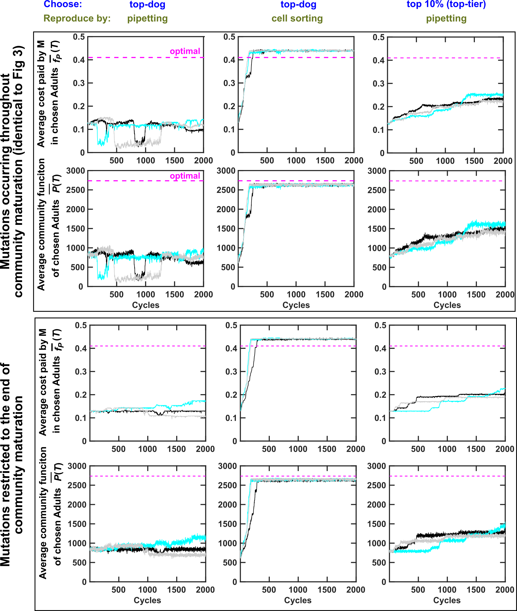

## Restricting mutation events to the end of a community maturation cycle may not help community selection

Selection dynamics of H-M communities. Top panel: duplicated from Fig 3 of https://doi.org/10.1371/journal.pbio.3000295
where mutations occur throughout the maturation cycles. Bottom panel: mutations are restricted to the last 20% of each maturation cycle. The mutation rate is adjusted so that the numbers of mutation events are comparable for the upper and the lower panels. Black, cyan and gray curves are three independent simulation trials.
